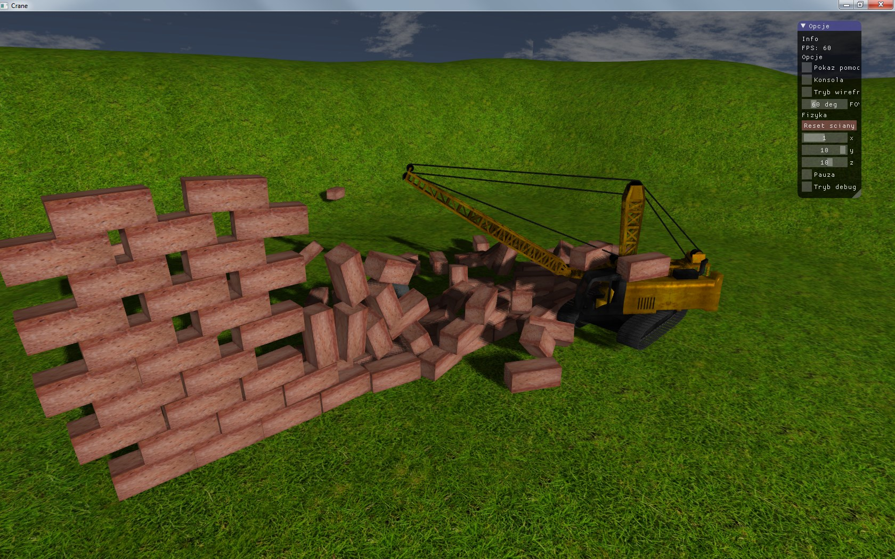

# Crane
Project written for **Computer graphics** course. Subject: wall demolition (crane + wrecking ball)

    

## Download
[Windows build](https://github.com/JaCzekanski/crane/archive/crane.zip)

This application requeires graphics card compatible with OpenGL 3.2.

## Language and libraries
- C++11
- OpenGL3.2
- Bullet
- SDL2
- GLM
- ImGUI
- LodePNG

## Authors
- Jakub Czekański
- Sylwester Czmil

## License
MIT